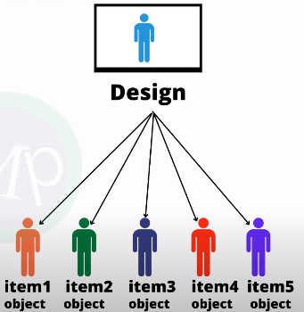

```
what is oops ?
why need oops ?
advantage of oops ?
disadvantage of oops ?
oops concept ?
how to write program in oops ?
--------------------------------------------------
what is oops ?
- object oriented programming system or object oriented programming language
- programming paradigm
    - approach/method/style/strategy to write program
- time complexity is less


- python follows 3 programming paradigm
    - oops
    - procedural
    - functional
- procedural programming paradigm
    - task divided into procedural programming
- functional programming paradigm
    - based on the logic solves the task
    - recursive functions
- these two programming paradigm are mostly based on the computional process
- oops programming paradigm
    - concentrates on the data
    - real world data centric problems are solved
    - first used in simula language
    - later used in c++ language
    - follows bottom up approach
--------------------------------------------------
what is object ?
- object is a real world entity
- everything is object
- pen, book, chair, table, fan, light, are objects
- object has 2 characteristics
    - properties
    - behaviour
- if we take person as object then the properties are
    - Name
    - Age
    - Height
    - Gender
    - Weight
    - Date of birth
- behaviour
    - walking
    - talking
    - eating
    - sleeping
    - running
    - jumping
    - dancing
    - singing
    - reading
    - writing
    - listening
    - watching
    - playing
    - etc
- if take pen as object then the properties are
    - color
    - brand
    - price
    - ink
    - type
    - etc
- behaviour of pen
    - writing
    - drawing
    - etc
- properties are called as 
    - attributes
    - variables
- behaviour are called as
    - methods/functions
    - procedures

- object has both properties and behaviour in a single object
- data security and access is easy

- if we need object is to be created then we need class
- class is object blue print
- with class only we can design the object 
```


